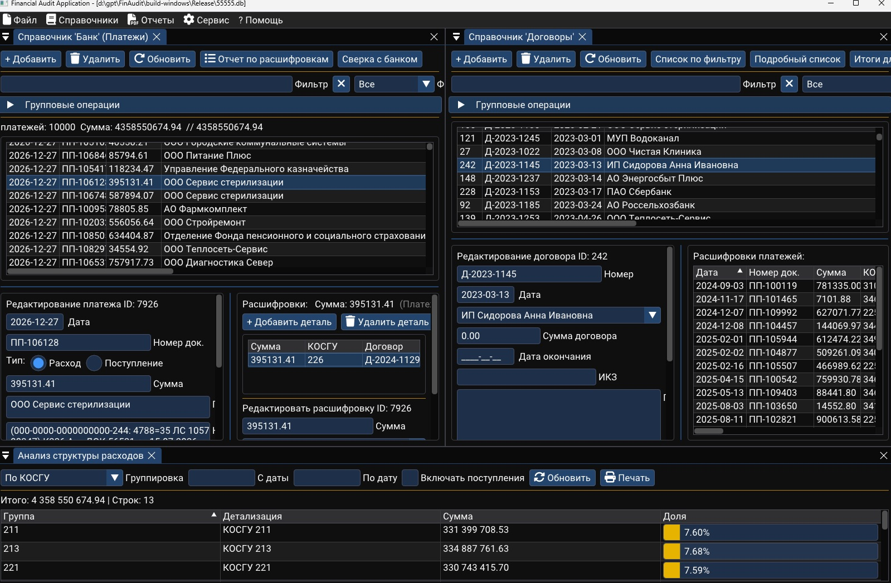

# Приложение для Финансового Аудита

Это настольное приложение на C++ для финансового аудита организаций государственного сектора. Оно использует библиотеку ImGui для графического пользовательского интерфейса и SQLite3 для управления базой данных.

## Скриншот:



## Возможности:

*   **Управление КОСГУ:** Операции создания, чтения, обновления и удаления (CRUD) для записей КОСГУ.
*   **Управление Платежами:** Функционал добавления, обновления и удаления записей платежей. Автоматическое предзаполнение даты для новых записей.
*   **Управление Контрагентами:** Операции CRUD для записей контрагентов. Надежная логика импорта обрабатывает поиск только по имени и значения ИНН NULL.
*   **Управление Договорам:** Операции CRUD для записей договоров.
*   **Управление Накладными:** Операции CRUD для записей накладных.
*   **Импорт из TSV:** Расширенная функциональность импорта из файлов TSV. Анализирует детали платежей, автоматически создает/обновляет контрагентов, извлекает/связывает договоры и накладные из описаний платежей. **Включает возможность прерывания длительных операций импорта.**
*   **Групповые операции (Договоры):**
    *   **Подтверждение операций:** Использует кастомный виджет подтверждения для групповых операций.
    *   **Фильтр "с ИКЗ":** Добавлен новый фильтр для отображения договоров с проставленным идентификатором закупки (ИКЗ).
    *   **Прерывание длительных операций:** Возможность отмены групповых операций.
*   **Групповые операции (Платежи):**
    *   **Расширенная операция "Определить по regex и проставить":** Добавлена возможность автоматического добавления/обновления расшифровок платежей с КОСГУ на основе регулярных выражений, если поле КОСГУ пустое. Правила добавления соответствуют логике импорта.
*   **Отчеты по расшифровкам:** Специальные отчеты в формах КОСГУ, Контрагенты и Банк:
    *   **КОСГУ:** Список расшифровок по выбранному КОСГУ с учетом фильтра.
    *   **Контрагенты:** Список расшифровок по выбранному контрагенту с учетом фильтра.
    *   **Банк:** Подробный список всех расшифровок платежей с данными платежа (тип, суммы, КОСГУ, контрагент).
    *   Все отчеты открываются в отдельном окне с возможностью сортировки, копирования и отображением итогов.
*   **PDF-отчетность:** Базовая генерация PDF для КОСГУ, результатов SQL-запросов и платежей.
*   **Выполнение SQL-запросов:** Инструмент для выполнения произвольных SQL SELECT-запросов и отображения результатов. **Включает возможность сортировки результатов по заголовкам столбцов.**
*   **Настройка регулярных выражений:** CRUD для правил извлечения данных из описаний платежей.
*   **Подозрительные слова:** Управление списком слов для выявления подозрительных операций.
*   **Импорт маппинга:** Настройка соответствий для импорта данных.
*   **Генератор тестовых данных:** Консольная утилита `TestDataGenerator` создает согласованные TSV-файлы для импорта банка и ЖО4. Используется для проверки логики обработки, сопоставления договоров и нагрузочного тестирования.

## Инструкции по сборке:

Проект использует CMake.

1.  Создайте директорию для сборки и перейдите в нее:
    ```bash
    mkdir build
    cd build
    ```
2.  Сконфигурируйте проект с CMake:
    ```bash
    cmake ..
    ```
3.  Выполните сборку:
    ```bash
    cmake --build .
    ```

Для Windows/MSBuild обычно используется конфигурация `Release`:

```powershell
cmake -S . -B build-windows
cmake --build build-windows --config Release
```

## Запуск приложения:

После успешной сборки исполняемый файл будет находиться в директории `build`.
```bash
build/FinancialAudit
```

## Генератор тестовых TSV:

Генератор создает два файла:

*   TSV для импорта банка.
*   TSV для импорта ЖО4.

Файлы согласованы между собой: сначала генерируется пул контрагентов и договоров, затем платежи и строки ЖО4 используют эти договоры. У одного контрагента создается несколько договоров, платежи повторно ссылаются на часть договоров. В назначении платежа добавляется министерский префикс с явным КОСГУ, например:

```text
(000-0000-0000000000-244: 4788=35 ЛС 105700347) К342 ...
```

По умолчанию генерируется `400` строк. Если имя файла указано без расширения, автоматически добавляется `.tsv`.

Примеры запуска после сборки Windows `Release`:

```powershell
cmake -S tools\test_data_generator -B build-test-data-generator
cmake --build build-test-data-generator --config Release

build-test-data-generator\Release\TestDataGenerator.exe
build-test-data-generator\Release\TestDataGenerator.exe load_test 1000
build-test-data-generator\Release\TestDataGenerator.exe --bank bank_load --jo4 jo4_load --count 10000
build-test-data-generator\Release\TestDataGenerator.exe load_test 1000 --seed 12345
```

Формы аргументов:

```text
TestDataGenerator [--bank BANK_NAME] [--jo4 JO4_NAME] [--count N] [--seed N]
TestDataGenerator BANK_NAME JO4_NAME [N]
TestDataGenerator BASE_NAME [N]
```

Особенности генерации:

*   `BASE_NAME 1000` создаст `BASE_NAME_bank.tsv` и `BASE_NAME_jo4.tsv`.
*   `--seed` позволяет воспроизвести тот же набор данных для повторной проверки ошибки.
*   В данных есть банки, казначейство, связь, коммунальные поставщики и обычные контрагенты.
*   Используются КОСГУ, включая `211`, `213`, `221`, `223`, а также материальные запасы, услуги и основные средства.
*   Часть назначений имитирует возможное нецелевое использование, например капитальный ремонт или ремонт кабинета на неподходящей статье.
*   Заголовки TSV подобраны так, чтобы автомаппинг импорта банка и ЖО4 распознавал поля без ручной настройки.

## Установка приложения (необязательно):

```bash
sudo cmake --install build
```

## Структура проекта:

```
FnAudit/
├── src/
│   ├── views/              # Формы приложения
│   │   ├── PaymentsView.*      # Форма "Банк/Платежи"
│   │   ├── KosguView.*         # Форма "КОСГУ"
│   │   ├── CounterpartiesView.* # Форма "Контрагенты"
│   │   ├── ContractsView.*     # Форма "Договоры"
│   │   ├── InvoicesView.*      # Форма "Накладные"
│   │   ├── SqlQueryView.*      # Форма "SQL-запрос"
│   │   ├── SpecialQueryView.*  # Форма "Специальный запрос" (отчеты)
│   │   ├── SettingsView.*      # Форма "Настройки"
│   │   ├── ImportMapView.*     # Форма "Импорт маппинг"
│   │   ├── RegexesView.*       # Форма "Регулярные выражения"
│   │   ├── SuspiciousWordsView.* # Форма "Подозрительные слова"
│   │   ├── SelectiveCleanView.* # Форма "Избирательная очистка"
│   │   ├── ContractRegistryNumbersView.* # Форма "Реестровые номера контрактов"
│   │   └── BaseView.h          # Базовый класс для всех форм
│   ├── DatabaseManager.*   # Работа с базой данных SQLite
│   ├── UIManager.*         # Управление интерфейсом
│   ├── ImportManager.*     # Импорт данных из TSV
│   ├── ExportManager.*     # Экспорт данных
│   ├── PdfReporter.*       # Генерация PDF-отчетов
│   ├── CustomWidgets.*     # Кастомные виджеты ImGui
│   └── ...
├── tools/
│   └── test_data_generator/ # Отдельная утилита генерации тестовых TSV
├── data/                   # Шрифты и ресурсы
├── CMakeLists.txt          # Конфигурация сборки
└── README.md               # Документация
```

## Текущий статус разработки:

*   Форма "Платежи" (включая фильтры, групповые операции и обработку regex) - **Завершено**
*   Форма "КОСГУ" (включая фильтры, оптимизацию производительности и отчет по расшифровкам) - **Завершено**
*   Форма "Контрагенты" (включая надежную логику импорта и отчет по расшифровкам) - **Завершено**
*   Форма "Договоры" (включая групповые операции и фильтр по ИКЗ) - **Завершено**
*   Форма "Накладные" - **Завершено**
*   Экспорт в PDF для Платежей, КОСГУ, SQL-запросов - **Завершено**
*   Импорт TSV (анализ договоров и накладных из описания) - **Завершено**
*   Сортировка результатов в произвольных SQL-запросах - **Завершено**
*   Прерывание длительных операций (групповые операции, импорт) - **Завершено**
*   Отчеты по расшифровкам (КОСГУ, Контрагенты, Банк) - **Завершено**
*   Настройка регулярных выражений - **Завершено**
*   Управление подозрительными словами - **Завершено**

## План развития:

Стабилизация базы данных, оптимизация импорта ЖО4, развитие риск-аналитики и сводных форм описаны в [ROADMAP_RU.md](ROADMAP_RU.md).
